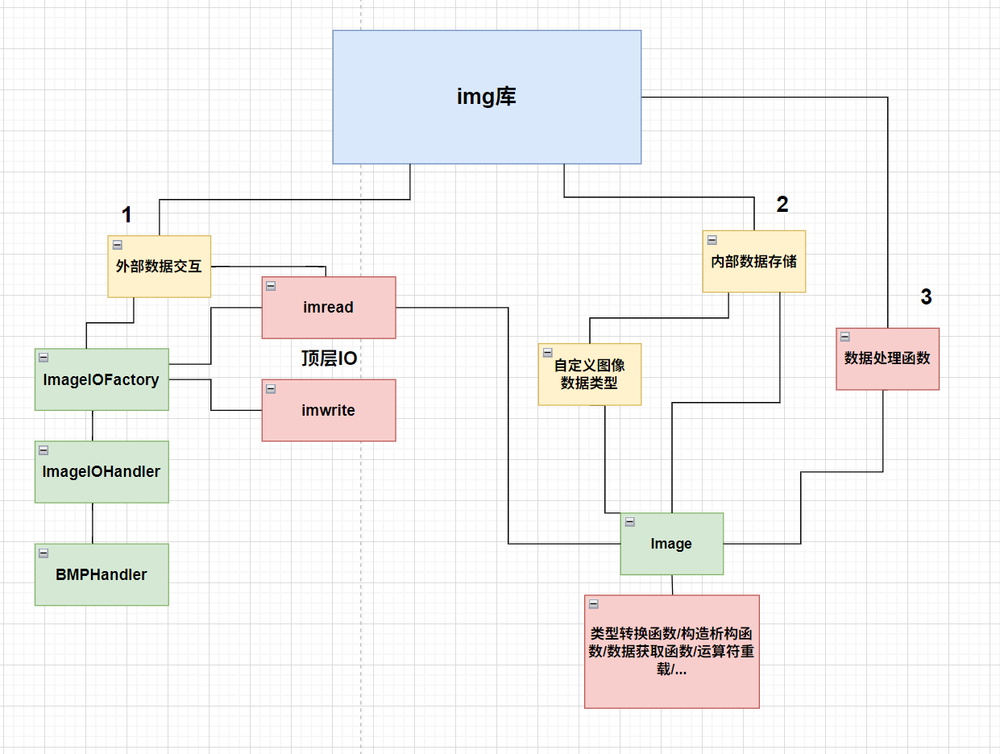
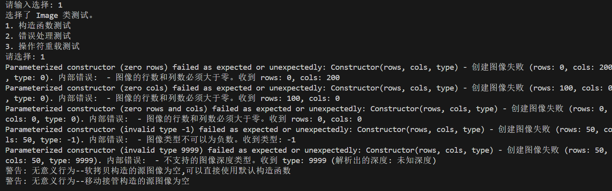
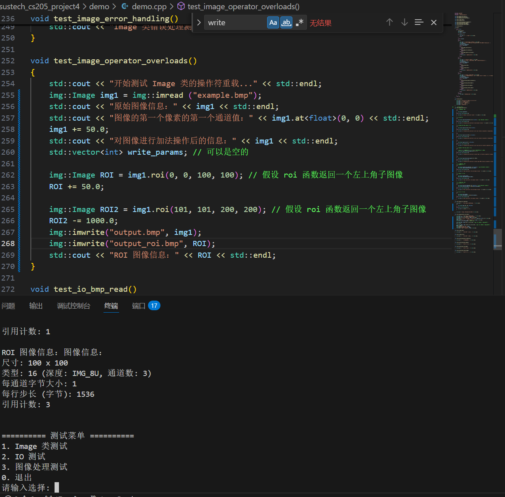
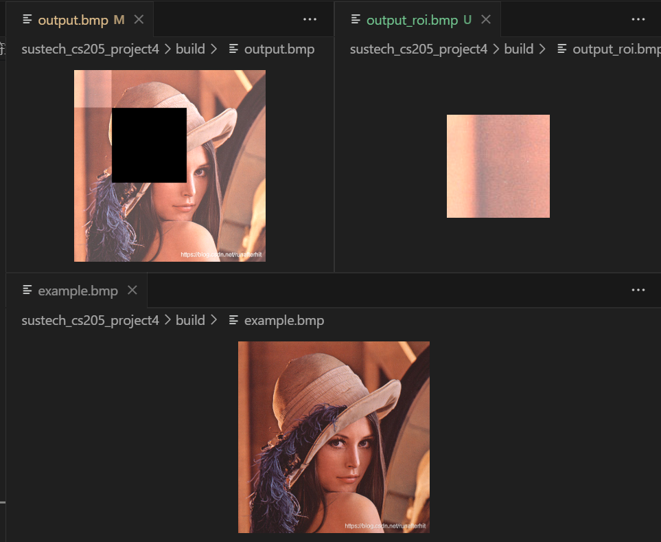
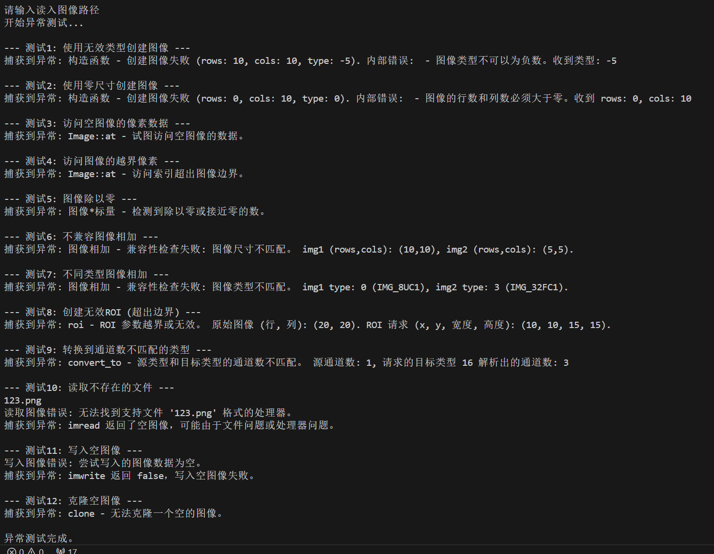

# CS205 Advanced Programming Project3
## A Simple Image Processing Library

12310907 吴嘉淇
- [CS205 Advanced Programming Project3](#cs205-advanced-programming-project3)
  - [A Simple Image Processing Library](#a-simple-image-processing-library)
- [零、摘要:](#零摘要)
- [一、Image类 (部分参考cv::Mat类)](#一image类-部分参考cvmat类)
  - [0."空"状态的定义和release()函数](#0空状态的定义和release函数)
  - [1.构造函数以及和数据相关的函数](#1构造函数以及和数据相关的函数)
    - [(1)对于空情况的容忍](#1对于空情况的容忍)
    - [(2)allocate函数--私有的内存分配核心函数](#2allocate函数--私有的内存分配核心函数)
  - [2.辅助函数以及运算符重载](#2辅助函数以及运算符重载)
    - [2.1 数据类型的定义](#21-数据类型的定义)
    - [2.2 运算符重载](#22-运算符重载)
    - [2.3 辅助函数](#23-辅助函数)
    - [3. 错误处理逻辑](#3-错误处理逻辑)
- [二、图像IO处理](#二图像io处理)
  - [1.ImageIOHandler 类 与其派生 BMP 类](#1imageiohandler-类-与其派生-bmp-类)
  - [2. ImageIOFactory 类](#2-imageiofactory-类)
    - [单例模式:](#单例模式)
    - [处理器注册 (register\_handler):](#处理器注册-register_handler)
    - [处理器检索 (get\_handler):](#处理器检索-get_handler)
    - [文件扩展名处理:](#文件扩展名处理)
  - [3. 顶层 IO 函数 (`imread` 和 `imwrite`)](#3-顶层-io-函数-imread-和-imwrite)
- [三、总结与其它代码的说明](#三总结与其它代码的说明)
# 零、摘要:

与之前所有的课程项目不同,本次项目的要求是开发一个图像处理库.

虽然之前完全没有库开发的经验,不过根据我之前对于库的了解,我认为要想开发好一个库需要从开发者和用户两方面考虑.

站在开发者的视角, 从维护成本和debug难度的角度出发, 库要拥有清晰的命名/注释/文档,尽可能避免冗余逻辑,统一的错误处理方式,易于扩展的架构等等特点.

站在使用者的视角,库需要明确使用者与开发者的责任,提供明确的说明文档并且保证在开发者完全按照文档提供所需内容时可以返回正确的结果,杜绝发生内部错误.(也就是说在用户输入错误数据的时候我会抛出异常,如果用户没有对异常进行处理导致程序崩溃那是用户的责任.).

出于这样的想法,我尝试完成了本次要求的简单图像处理库. 在保证内存安全的同时实现了一些非常简单和基础的图像处理功能,并且尽可能地提供了一个易于维护和扩展的功能和异常处理框架以及做了少量的计算优化.(下面是我使用开源软件绘制[draw.io](https://www.drawio.com/)的项目结构图).



不过我也不得不承认, 这次项目真的非常困难, 我的实现也还存在诸多的难以解决的失误和问题,我之后会把每个关键的点在报告的对应的部分中指出.

附注：

代码使用方法：我本来的代码结构可以参见github仓库

# 一、Image类 (部分参考cv::Mat类)

库内部所有对于图像的操作均依赖Image类进行.

由于Image类内部的函数较多,在第一部分中我主要说明一下一些重点函数的设计逻辑.

## 0."空"状态的定义和release()函数

在进入构造函数的设计思路之前,我希望先澄清我对于我的代码里"empty"状态(也可以理解成默认状态)的理解和涉及的操作,并且也声明release函数是把一个对象回复为empty的函数.

正如我们之前学习到,cpp中的数据会存放于堆上或是栈上.

```cpp
        size_t m_rows;         // 像素行数
        size_t m_cols;         // 像素列数
        int m_type;            // 图像类型 (深度和通道的组合)
        size_t m_channel_size; // 单个通道元素占用的字节数 (例如 IMG_8U 为 1, IMG_32F 为 4)
        size_t m_step;         // 每一行数据所占用的总字节数

        unsigned char *m_data_start;  // 指向图像在堆上有效像素数据的起始位置
        unsigned char *m_datastorage; // 指向实际在堆上分配的内存块的起始位置 (包含引用计数)
        int *m_refcount;              // 指向存储引用计数的位置
```

在我的image类的所有数据成员中,所有的声明的数据都在栈内存上存储,而后边三行的指针所指向的数据则是在堆上存储.

在我的图像处理库中,我将空状态定义为 "在堆上没有数据的状态"

也就是说 空的对象也会占用栈sizeof(image)的内存空间,我认为对于空状态更好的称呼应该是默认状态

不过由于我定义了empty()成员函数,我在之后还是用空状态来称呼它

而对于release函数(也同样是析构函数),它的作用只是清空堆上的内存,而栈上对象在栈上仍然占用空间,我们应该把它给理解成一个把对象恢复为默认状态的函数,而不是消除这个对象的函数.

## 1.构造函数以及和数据相关的函数

### (1)对于空情况的容忍
涉及到数据初始化或是转移的函数对于空情况的处理逻辑如下表所示:
| 函数声明                                   | 是否支持空图像 | 解释                                                                                                                                                              |
| :----------------------------------------- | :------------- | :----------------------------------------------------------------------------------------------------------------------------------------------------------------- |
| `Image()`                                   | 是             | 默认构造函数创建一个空图像对象，所有成员变量初始化为默认值，无需分配内存。                                                                                             |
| `Image(size_t rows, size_t cols, int type)` | 否             | 如果传入的尺寸或类型不符合要求则会抛出异常，不支持创建空图像。                                                                                                       |
| `Image(const Image& other)`                 | 是             | 拷贝构造函数支持软拷贝空图像，拷贝后新对象也为空状态。但是库会弹出警告说更好的办法是直接使用默认构造函数。                                                               |
| `Image(Image&& other)`                      | 是             | 移动构造函数支持接管空图像，接管后新对象为空状态，原对象也为空状态。但是库会弹出警告说更好的办法是直接使用默认构造函数。                                                               |
| `void create(size_t rows, size_t cols, int type)` | 否             | 如果传入的尺寸或类型无效，则会抛出异常，不支持把空的对象create成空对象。                                                                                               |
| `void release()`                            | 是             | 支持释放空图像，调用后对象仍为空状态。                                                                                                                                 |
| `Image clone() const`                       | 否             | 不支持克隆空图像。                                                                                                                                                   |


(弹出警告效果)

注: create函数的作用主要是将默认对象（空对象）给转化为有实际内存分配的图像，其功能与 = 赋值运算符类似，不过无需再创建一个新的对象就可以赋值,在后续的部分函数以及一些特定的需求场景可以使用.

一句话总结,所有需要调用allocate的函数都不支持创建空图像,严格控制得到默认状态的方法到使用默认构造函数或者对空图像进行软拷贝(这样会有警告)

其它情况严格禁止创建没有实际数据的只有头的空图像.

### (2)allocate函数--私有的内存分配核心函数

在库的代码中,allocate函数被有参构造函数,深拷贝函数(clone)和create函数直接调用.下面来讲解内存分配函数的逻辑.

首先,作为一个很底层的函数,allocate函数会抛出很多报错信息给上层,当然使用库的用户并不会看到它的名称,而是只会说内部错误,这个会在之后的错误处理部分详细说明.

前面的部分我写的相对比较顺利，可是在完成后边的部分在最后逐行检查代码的时候却产生了一个内存安全问题.

我原来的代码大致类似这样(省掉了一些错误处理部分,我只是想说它为什么是错的)
```cpp
    new_datastorage_ptr = new unsigned char[total_alloc_size]();
    m_datastorage = new_datastorage_ptr;
    m_refcount = new (m_datastorage) int(1);
    *m_refcount = 1;
    m_data_start = m_datastorage + size_for_refcount;

    m_rows = rows;
    m_cols = cols;
    m_type = type;
    m_channel_size = static_cast<unsigned char>(local_channel_size);
    m_step = current_step;
```
(值得一提的是要写对这个有安全隐患的代码同样有坑,如果用下面这句就不会初始化为0而是变成垃圾值)
```cpp
new_datastorage_ptr = new unsigned char[total_alloc_size];
```

这部分代码头一次看起来没有什么问题,但是在最后检查的时候我才发现我的数据并没有保证在堆内存在整数的四字节上对齐,

也就是说m_refcount = new (m_datastorage) int(1);这行可能会出现内存安全问题.

这是十分让人崩溃的,因为不管是allocate还是我的图像数据类型都是最底层的逻辑,如果对他们进行修改的话我整个库的大部分都得重写.

好在,在AI的帮助下,我通过下面的解决思路在最小的范围内(只修改release和allocate)很巧妙的修复了内存对齐的问题:

首先,我的最重要的需求有两个: 

其一是尽量不影响其它已经实现函数,这就要求m_datastorage的存储逻辑不能变

其二则是需要让 m_refcount = new (m_datastorage) int(1);的m_refcount从一个从满足整数对齐的位置开始(为了后续的操作,我最后选择从满足8字节对齐的位置开始而不是四字节,不过对此处没有影响)

为了满足这两个需求,AI给了我一个嵌套在原来的 m_datastorage 之上的存储结构:

| 内存结构                                                              |
|-----------------------------------------------------------------------------|
| 实际分配的内存地址开始位置                                                          |
| 一些空白填充字节，保证后边的数据按照四位对齐                                |
| 指向真实地址开始位置的存在堆上的指针（64位系统是8字节，使用 memcpy 将地址的值拷贝到m_datastorage前面紧贴着的对应位置                                |
| 图像的实际数据（m_datastorage开始的位置，与之前没有变化）                                                              |
| 多余的分配填充位（分配需要对齐数量-1的填充位，可能会有剩余）   

按照这样的结构,除了原来分配的 sizeof(int) + 图像像素数据大小 之外,

还需要额外 + 最多需要的填充位个数 (地址必须整除的数字 -1) + 指向真实存储数据开头的指针的大小(通常是8字节)

而在release函数中,我们只需要稍作修改,把delete从m_datastorage开始改成从 存放在堆上的指针所指向的位置 开始即可.

首先对于需求1, 这个解决方案非常完美的没有影响到其它函数或是类的定义,因为它们只会从m_datastorage开始调取数据,并不会考虑其之前的情况.

而对于需求2,这个解决方案也解决了对齐问题.

我认为这个方案真的十分巧妙,虽然它只是一个补救操作(肯定不是最好的),但是却在体现了指针的强大能力也让我深刻理解了看起来行的代码可能不行的道理,同时也良好的解决了其它部分有关内存对齐问题的隐患, 所以我把它写在了报告里.

不过总的来讲,感觉还是智能指针更加安全和方便，下一次我会使用智能指针.

## 2.辅助函数以及运算符重载

在image类中,除了构造函数和一些数据拷贝相关的函数之外,还实现了一系列辅助函数以及运算符重载.

### 2.1 数据类型的定义

项目的image类几乎完全照搬OpenCV中的cv::Mat的类型的定义，使用了一系列宏定义来表示图像的深度和类型.

这些宏定义包括图像的深度（如IMG_8U、IMG_32F）和图像类型（如IMG_8UC3表示8位无符号整数的三通道图像）

虽然宏的使用确实带来了很多方便(例如增加可读性,函数参数传入只需要一个整数就可以得到类型等等),宏的文本替换的特性也给我带来了一些问题.

在我的代码中,由于type和depth以及cn的一一对应关系只能在正整数条件并且在特定范围内成立, 而宏自身又不能检查输入,我必须在每一个使用宏的地方进行严格的类型检查来防止函数崩溃,这在一定程度上增加了我的代码量.

更糟糕的是,由于在最开始我没有意识到这一点,我把矩阵为空的 type 的特殊值设置为了-1. 这极大地增加了我的代码的维护难度,是一个非常难受的点.

反观openCV,它在进行默认构造的时候会把type设置为0. 虽然0会与IMG_8UC1 的type发生冲突,但是这样可以避免负数导致程序崩溃的问题.

所以,我认为可能也许完全舍弃掉使用宏来计算深度和管道的设计然后使用函数来替代可能更好,并且在后续的检查中把在代码中多次出现的IMG_DEPTH和IMG_CN两个宏给替换成了inline函数,确保对于参数正确性的检查.

### 2.2 运算符重载

在本次库的编辑中,除了赋值运算符, 我还重载了 +-*/ (+-支持图像图像和图像标量,*/支持图像标量,+*拥有友元函数) 以及编写了 << 运算符的友元函数用于打印图像信息(较为简单,借助show_info方法,两者的打印信息完全一致)

对于四则运算的重载 ,总体的策略是

要求用户输入double数据, 然后在double条件下计算之后并且在最终进行截断或是舍入

并且使用宏 truncate_value 系列模板函数(在image.cpp中声明减小头文件大小) 和 IMAGE_SCALAR_OP_LOOP来实现核心逻辑.

其中,truncate_value函数主要用途是把整型数据进行截断,避免溢出,

而以下是 IMAGE_SCALAR_OP_LOOP 宏的定义
```cpp
#define IMAGE_SCALAR_OP_LOOP(OP, TYPE, truncate_value)                                \
    for (size_t r = 0; r < m_rows; ++r)                                           \
    {                                                                             \
        unsigned char *row_ptr = this->get_rowptr(r);                             \
        for (size_t c = 0; c < m_cols; ++c)                                       \
        {                                                                         \
            TYPE *pixel_ptr = reinterpret_cast<TYPE *>(row_ptr + c * pixel_size); \
            for (int chan = 0; chan < channel_cnt; ++chan)                        \
            {                                                                     \
                double result = static_cast<double>(pixel_ptr[chan]) OP scalar_d; \
                pixel_ptr[chan] = truncate_value(result);                             \
            }                                                                     \
        }                                                                         \
    }
```
你可能发现在宏的内部存在reinterpret_cast这一危险操作,在内存没有按照TYPE对齐的时候可能会发生未定义行为.

但是由于我们在allocate时分配int地址是按照四字节对齐分配的,所有 datastorage 指针指向了一个可以整除四的地址.

然后int的大小又是4,

所以我们其实可以保证数据的开头地址是可以整除8的(很遗憾在int为2的时候有概率会出问题,但是现代计算机int基本为4位).

之后,在这里pixel_ptr的指针类型 不管要求1,2,4还是 8的对齐,我们都可以保证row_ptr肯定满足1,2,4或是8的对齐,(因为每一次会加一个像素,像素是对应通道大小的整数倍)

因此,我们也可以保证 reinterpret_cast 在被调用的时候是满足 TYPE 的对其需求的. 因此 reinterpret_cast 几乎没有 在对齐方面的UB危险.

除了内存对齐问题之外,这个宏的逻辑很简单,就是对于每个通道依次计算大小,再通过truncate_value进行裁剪.

而对于图像和图像的相加减,除了增加了check_compatibility方法来检查图像兼容性之外,整体的实现逻辑类似,这里就不再赘述.


### 2.3 辅助函数

除了比较基础和简单的get系列之外 , 库还有 at, roi 和 convert_to 三个实现相对比较复杂的辅助函数.
 
at使用了模板函数来进行实现,用户在使用at的时候需要手动指定希望得到的数据类型(实现在了头文件内).

at的实现上需要注意的有两点,

其一是用户需要自己对输入的类型负责,我并没有内置检查类型的功能,如果用户输入了错误的类型仍然会返回对应类型的指针,库对此不负责

其二是与opencv不同,本库的at方法只会返回指向像素第一个通道的指针,而不是返回一个包装好的像素类型(例如多通道时只会返回指向第一个通道的指针),用户需要通过加法来自己来获取想要的通道的指针

roi函数则是实现了选取感兴趣区域的功能.

其m_datastorage指向了和roi所属图片一样的地址,由于之前介绍过的无痛修复对齐bug的策略,我在这里并不需要重写.

由于roi的本质是一个新的图像(它调用了默认构造函数,但是之后我会修改它的状态,保证参数属于合法的非空图像),在这里我需要增加它的引用次数.

对于roi图像可以进行所有能对正常图像进行的操作,效果如下图所示:

测试代码:


效果演示:


可以看到,虽然好像实现不是很困难, 但是这其实是一个非常强大的功能.

convert_to函数实现了通道数量相同的不同数据类型的图像之间的转化

convert_to函数的整体实现比较暴力,总体思路是遍历每一个像素,先把每个通道的值转化成double再使用之前提到过的truncate_value函数来把double的通道值给转化成目标数据.

设计这个函数主要是为了方便用户把经过处理的图像给截断成8U数据类型来方便输出为BMP图像(也是目前唯一支持的文件类型.下一部分会讲)

不过它的功能很有限.感觉有一些的扩展空间.

以下是一些测试:
测试代码
```cpp
img::Image img2 = img::imread("example2.bmp");
    img::Image ROI1 = img2.roi(0, 0, 200, 200);
    img::Image ROI2 = img2.roi(201, 201, 200, 200);
    std::cout << ROI2 << std::endl;
    try
    {
        img2.convert_to(IMG_64FC3);
    }
    catch (const std::exception &e)
    {
        std::cerr << e.what() << '\n';
    }
    img::Image img3 = (ROI1.convert_to(IMG_64FC4) + ROI2.convert_to(IMG_64FC4)) / 2;
    std::cout << img3 << std::endl;
    try
    {
        img::imwrite("conversion_test.bmp", img3);
    }
    catch(const std::exception& e)
    {
        std::cerr << e.what() << '\n';
    }
    img::Image img4 = img3.convert_to(IMG_8UC4);
    std::cout << img4 << std::endl;
    img::imwrite("conversion_test.bmp", img4);
```
输出结果:
```cpp
图像信息：
尺寸: 200 x 200
类型: 24 (深度: IMG_8U, 通道数: 4)
每通道字节大小: 1
每行步长 (字节): 12288
引用计数: 3
//第一个catch,转化不支持不同的通道数
convert_to - 源类型和目标类型的通道数不匹配。 源通道数: 4, 请求的目标类型 20 解析出的通道数: 3 
图像信息：
尺寸: 200 x 200
类型: 28 (深度: IMG_64F, 通道数: 4)
每通道字节大小: 8
每行步长 (字节): 6400
引用计数: 1
//第二个catch,bmp需要8U格式
BMP 写入错误: 不支持的BMP图像类型 (仅支持 8UC3 或 8UC4 格式)。
图像信息：
尺寸: 200 x 200
类型: 24 (深度: IMG_8U, 通道数: 4)
每通道字节大小: 1
每行步长 (字节): 800
引用计数: 1
```

### 3. 错误处理逻辑
在这次程序编写中,我添加了很丰富的抛出错误的语句,并且通过try catch语句来非常清晰明确的指出了报错的具体函数和与错误有关的一些重要信息.

同时,对于哪些不严重的小问题,我也会抛出警告而不终止程序的运行.

然而,在我几乎完成第一版代码的时候,我才发现了一个非常严重的问题:

作为一个库的开发者,我的报错信息不应该暴露内部函数的实现情况

由于一开始没有意识到这一点,我后边对于整个库的错误处理系统的修改其实是比较困难的.

不过好在,我的整个图像类中函数与函数之间的模块化做的还不错,相互调用的情况比较少,实际上我只要想办法catch所有内部函数的错误信息,然后提取其中有效部分往上传输即可.

为了更好与更规范的完成这项功能,我也定义了下面这个宏来完成报错信息头的编辑,从而使得报错更加规范化.

```cpp
#define IMG_ERROR_PREFIX(function_name) (function_name + " - ")
```

# 二、图像IO处理

在讲解完成image类的实现中一些解决了/没有很好的解决的困难之后,我接下来来讲一讲库和文件的交互部分(实现存储在image_io.cpp中).

首先，整个IO部分的核心是一个基于抽象处理器和中心工厂的设计模式,既有很明显的分层特性.

具体来说,IO部分可以分成下面几层(也可以参考摘要里的图片)：

抽象层 (`ImageIOHandler`): 定义了所有图像文件格式处理器的标准接口。这确保了无论处理何种图像类型（如BMP, PNG, JPG等），上层代码都可以用统一的方式进行交互，实现了多态性。

具体实现层 (如 `BMPHandler`): 派生自抽象层，封装了特定图像格式的读取和写入逻辑。这种设计使得添加对新图像格式的支持变得简单——只需创建一个新的派生类并实现其接口即可，体现了开闭原则。

管理与分发层 (`ImageIOFactory`): 这是一个单例工厂，负责注册、管理所有具体的图像处理器，并根据文件名（通常是文件扩展名）向客户端代码（如顶层 `imread`/`imwrite函数）提供合适的处理器实例。

用户接口层 (顶层 `imread`/`imwrite函数): 为最终用户或库的其他部分提供了简洁易用的图像读写函数。它们内部会与 `ImageIOFactory交互，获取相应的处理器来完成实际的IO操作，并处理如错误报告（如你提到的返回空图像和打印警告）等事宜。

这种分层、解耦的架构，使得图像IO系统不仅功能清晰，而且具有良好的可维护性和可扩展性。开发者可以专注于实现特定格式的解析逻辑，而不必关心整个IO流程的编排。

那接下来我从下往上简要地讲一讲一些实现细节.

## 1.ImageIOHandler 类 与其派生 BMP 类

ImageIOHandler 类是所有图像解析器类的父类.

通过声明纯虚函数,这个抽象类定义了所有图像解析器需要继承并且实现的三种方法:

```
virtual Image h_read(const std::string &filename) const = 0;
virtual bool h_write(const std::string &filename, const Image &img) const = 0;
virtual std::vector<std::string> get_supported_extensions() const = 0;
```

三个方法的功能都比较直白,这里就不细解释了.

在io相关方法的实现文件中, BMPHandler继承了该类,并且按照上一次项目的方式定义了内置的BMP结构体并且实现了这三个方法.

在遇到错误时,这些异常会在顶层IO函数imread和imwrite中进行进一步的包装,

由于考虑到IO操作真的非常耗费时间,我最后决定设计在顶层的IO函数中并不会抛出异常,而是只会弹出警告来说明操作并没有正常进行.

对于读取,如果没有顺利读取的话会返回空图像并打印警告;对于写入,函数会放弃写入图像并且弹出警告.

在ImageIOHandler类中我声明了virtual 的析构函数来使得子类可以调用自己的析构函数,不过由于Handler类都没有数据成员,所有都直接使用默认析构函数即可.

## 2. ImageIOFactory 类

这一部分的实现从精神上参考了OpenCV处理不同类型图像的方法，不过进行了极度的简化，使其更轻量且易于理解。ImageIOFactory 类是整个IO系统的中央调度器和管理者，它有以下几个核心职责和特性：

###  单例模式:
工厂类通过 static ImageIOFactory& get_instance()方法提供全局唯一的访问点。

其构造函数被声明为 private，

并且拷贝与移动相关的构造函数和赋值运算符均被 delete，严格保证了在整个程序生命周期中只有一个 ImageIOFactory 实例存在。

###  处理器注册 (register_handler):
这是工厂的核心扩展机制。通过 void register_handler(std::unique_ptr<ImageIOHandler> handler)方法，可以将具体的 ImageIOHandler 派生类实例（如 BMPHandler 等）注册到工厂中。

方法参数为 std::unique_ptr<ImageIOHandler>，表明一旦处理器被注册，其所有权就完全转移给了工厂。(上课讲过的智能指针的特性)

这些 unique_ptr被存储在一个 std::vector<std::unique_ptr <ImageIOHandler>> m_registered_handlers 的成员变量中。

当 ImageIOFactory 单例对象在程序结束时被销毁，m_registered_handlers中的所有 unique_ptr也会被销毁，从而自动调用其所指向的 ImageIOHandler 对象的析构函数，确保资源被正确释放。

在注册处理器的同时，工厂会调用该处理器的 get_supported_extensions()方法获取其支持的所有文件扩展名。然后，工厂会将这些扩展名（转换为小写）与对应的处理器原始指针（ImageIOHandler*）存储在一个 std::unordered_map<std::string, ImageIOHandler*> m_handlers_map中。

这个哈希表用于后续的快速查找。

###  处理器检索 (get_handler):

当顶层函数 imread或 imwrite需要处理一个文件时，它们会调用工厂的 ImageIOHandler* get_handler(const std::string& filename) const方法。

该方法首先使用静态辅助函数 get_file_extension_lower(filename)从输入的文件名中提取出小写的文件扩展名。
然后，它以这个小写扩展名为键，在 m_handlers_map中查找对应的 ImageIOHandler*。

如果找到匹配的处理器，则返回该处理器的原始指针；如果未找到，则返回 nullptr。

值得注意的是，m_handlers_map中存储的是观察者指针 (non-owning raw pointers)，它们仅用于快速定位处理器，而不负责管理其生命周期。实际的生命周期由 m_registered_handlers中的 unique_ptr控制。

###  文件扩展名处理:
静态私有方法 get_file_extension_lower(const std::string& filename)负责从完整文件名中提取出扩展名，并将其转换为小写，以确保在 m_handlers_map中的查找不区分大小写。

**总的来说**，

ImageIOFactory 通过以下方式运作：

在程序初始化阶段，各种具体的图像处理器被创建并注册到唯一的工厂实例中，工厂接管这些处理器的所有权。当需要读写图像文件时，上层代码向工厂请求一个能处理特定文件的处理器。工厂快速查找并返回一个合适的处理器。上层代码随后使用返回的处理器执行实际的读写操作。

这种设计使得添加对新图像格式的支持变得非常简单：只需实现一个新的 ImageIOHandler 派生类，并在程序启动时将其注册到工厂即可，无需修改工厂本身或已有的顶层IO函数。这体现了开闭原则和依赖倒置原则。

## 3. 顶层 IO 函数 (`imread` 和 `imwrite`)

顶层 IO 函数 `imread` 和 `imwrite` 是用户与图像文件进行直接交互的主要接口。

它们封装了与 ImageIOFactory 和具体 ImageIOHandler 的交互细节，

为用户提供了简洁和统一的图像读写体验。

对于读取函数,其内部执行流程如下：

首先，通过 `ImageIOFactory::get_instance()` 获取工厂的单例对象。(函数内部会避免重新注册)
接着，调用工厂的 `get_handler(filename)` 方法，传入文件名以获取能够处理该文件类型的 ImageIOHandler 指针。

如果 `get_handler` 返回一个有效的处理器指针 (非 `nullptr`)，则调用该处理器的 `h_read(filename)` 方法。
此方法执行实际的文件读取和解码操作，并返回一个 Image 对象。

如果 `get_handler` 返回 `nullptr`，或者 `h_read` 方法在执行过程中遇到错误，`imread` 函数将返回一个空图像。
根据之前的设计决策，当读取失败时，除了返回空图像，还会在控制台打印一条警告信息，指明读取操作未成功，但程序不会因此而终止。

而对于写入函数,其内部执行流程与 `imread` 类似,只是变成了调用h_write,这里就不再赘述了.

通过这种方式，顶层 IO 函数屏蔽了底层的复杂性。用户无需关心具体的文件格式是如何被处理的，也无需直接与工厂或处理器打交道。同时，统一的错误处理策略为用户提供了一致的反馈机制。


# 三、总结与其它代码的说明

图像IO设计和Image类的设计是本次项目中的重点部分，虽然做的可能不是特别好，但是它们确实是花费了我最多精力的部分.

除了上边的代码之外,我在头文件里声明了只一些很简单的图像处理函数(亮度调整和融合图像),并且在processor.cpp里头把它们进行了实现.由于目前核心数据结构以及总体架构已经设计完成了,之后再添加新的处理函数应该不太困难.

另外,我还给库写了一个demo.cpp用来作为功能演示. 通过CMakeList,再使用make指令之后这个文件会自动被编译,用户可以通过阅读文件中的代码或是运行可执行文件来了解库的设计和使用.

例如下图是异常测试部分:



**最后,来进行一下总结:**

首先,这次项目我认识到了"设计模式"的重要性. 不论是类的设计, IO设计还是错误处理的设计, 不管是用什么语言, 遵从一个科学且合理的设计模式是很重要的.

除此之外,我也认识到了内存安全除了内存泄漏/越界这样相对来说比较容易控制和避免的问题之外, 还存在内存对齐这样的潜在的,可能不会出错但是会埋下隐患的问题,也是有了更加丰富的经验.

本项目与这门课第一个项目类似,看似简单,但是实际写起来却非常困难,给人一种拼尽全力无法战胜的感觉.

不过在我完整的走完了实现一个很简单的cpp图像处理库的流程之后,虽说可能并没有实现太多高级功能,

但是我认为我在第一部分里的关于堆上的指针的思路是很让我惊喜的,以及工厂模式这一种常见的设计模式,我可能也可以在以后的开发中用到,还有错误处理的分层截取的设计和一些宏的奇妙bug,我也会在之后的项目刚开始的时候就注意到这些问题,从而减少开发的成本.

总的来说,这次感觉格外的收获满满,是一个很锻炼人的项目.


